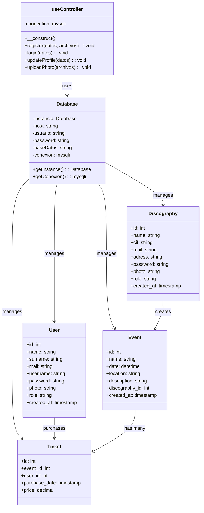
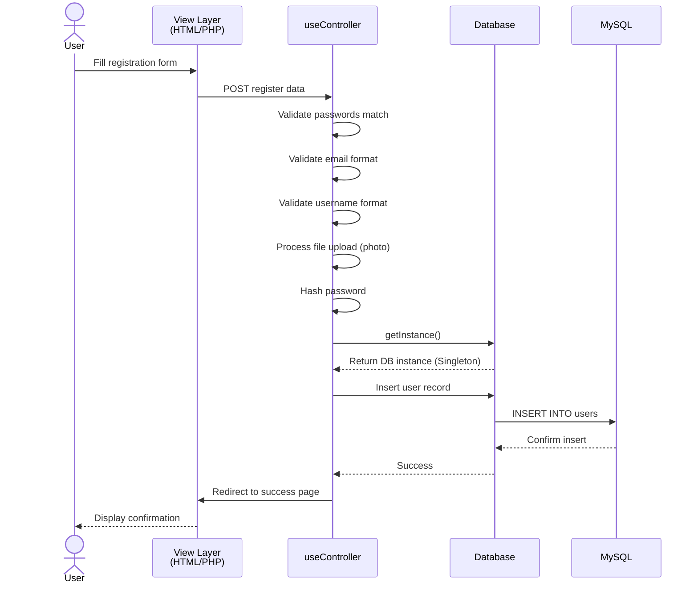
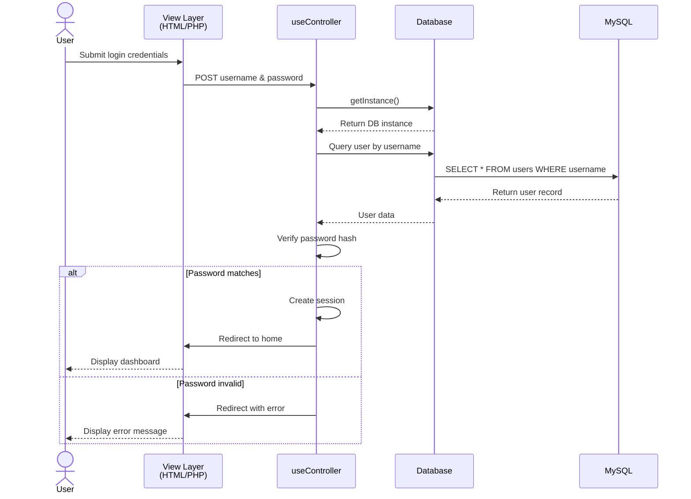

# GlobalTicket - Event Management System
A PHP-based event management and ticketing system with support for multiple user roles (regular users and discographies/record labels).

## Overview

GlobalTicket is an MVC-based web application that allows users to manage events, purchase tickets, and handle user profiles. Discographies (record labels) can manage their own events and users can browse and register for events.

## Features

- **User Management**: User registration, login, and profile management
- **Discography Management**: Discography registration and profile management  
- **Event Management**: Create, edit, and manage events
- **Ticket System**: Purchase and manage event tickets
- **File Uploads**: User and discography photo uploads
- **Authentication**: Secure login and session management

## Project Structure

```
GlobalTicket/
├── Controller/          # Business logic and request handlers
│   ├── useController.php     # User registration and management logic
│   └── logout.php            # Logout functionality
├── Model/              # Database and data access layer
│   ├── db.php              # Database connection (Singleton pattern)
│   └── tables.sql          # Database schema and initial data
├── View/               # User interface and presentation layer
│   ├── home/               # Home page
│   ├── login/              # Login page
│   ├── signIn/             # User and discography registration
│   ├── profile/            # User and discography profiles
│   ├── event/              # Event listing and management
│   └── uploads/            # File upload directory
└── README.md           # This file
```

## Technology Stack

- **Backend**: PHP 7.4+
- **Database**: MySQL/MariaDB
- **Frontend**: HTML5, CSS3
- **Pattern**: MVC (Model-View-Controller)

## Architecture

### Class Diagram



### Sequence Diagram - User Registration Flow



### Sequence Diagram - User Login Flow



## Installation & Setup

### Prerequisites
- PHP 7.4 or higher
- MySQL 5.7 or higher
- Apache with `mod_rewrite` enabled
- XAMPP or similar local development environment

### Steps

1. **Clone/Copy the project to XAMPP**
   ```bash
   cp -r GlobalTicket c:\xampp\htdocs\
   ```

2. **Create the database**
   ```bash
   mysql -u root -p < Model/tables.sql
   ```
   Or import `Model/tables.sql` through phpMyAdmin

3. **Configure database connection** (if needed)
   - Edit `Model/db.php`
   - Update host, username, password, and database name

4. **Set up uploads directory**
   ```bash
   mkdir -p View/uploads
   chmod 755 View/uploads
   ```

5. **Access the application**
   ```
   http://localhost/GlobalTicket/View/home/home.php
   ```

## Database Schema

### Users Table
- `id` - Primary key
- `name, surname` - User full name
- `mail` - Email (unique)
- `username` - Username (unique, 3+ chars, alphanumeric + underscore)
- `password` - Hashed password
- `cellphone` - Phone number
- `photo` - Profile photo path
- `role` - User role (default: 'user')
- `created_at, updated_at` - Timestamps

### Discographies Table
- `id` - Primary key
- `name` - Company name
- `cif` - Tax identification number (unique)
- `mail` - Email (unique)
- `adress` - Business address
- `password` - Hashed password
- `cellphone` - Phone number
- `photo` - Company logo path
- `role` - Role (default: 'discography')
- `created_at, updated_at` - Timestamps

## Validation Rules

### User Registration
- **Email**: Must be valid email format
- **Username**: Minimum 3 characters, only letters, numbers, and underscores
- **Password**: Must match confirmation password
- **Photo**: Optional, must be valid image file

### Discography Registration
Similar rules to user registration with additional CIF validation

## Design Patterns Used

1. **Singleton Pattern** - Database class ensures only one database connection instance
2. **MVC Pattern** - Separation of concerns between Model, View, and Controller
3. **File Upload Handling** - Secure file validation and storage

## Security Features

- Password hashing (prepared statements recommended)
- Email validation
- File type validation on uploads
- Input validation and error handling
- Session management
- Unique constraints on username and email

## Future Enhancements

- [ ] Implement prepared statements for SQL injection prevention
- [ ] Add email verification for new accounts
- [ ] Implement password reset functionality
- [ ] Add search and filtering for events
- [ ] Implement payment gateway integration
- [ ] Add notification system
- [ ] Implement API endpoints
- [ ] Add unit tests

## Author

GlobalTicket Development Team

## License

MIT License

---

**Note**: This project is in development. Database credentials are set for local XAMPP installation. Update credentials in `Model/db.php` before deploying to production.
